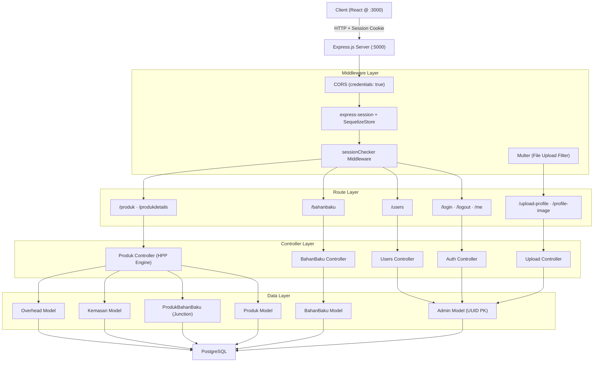
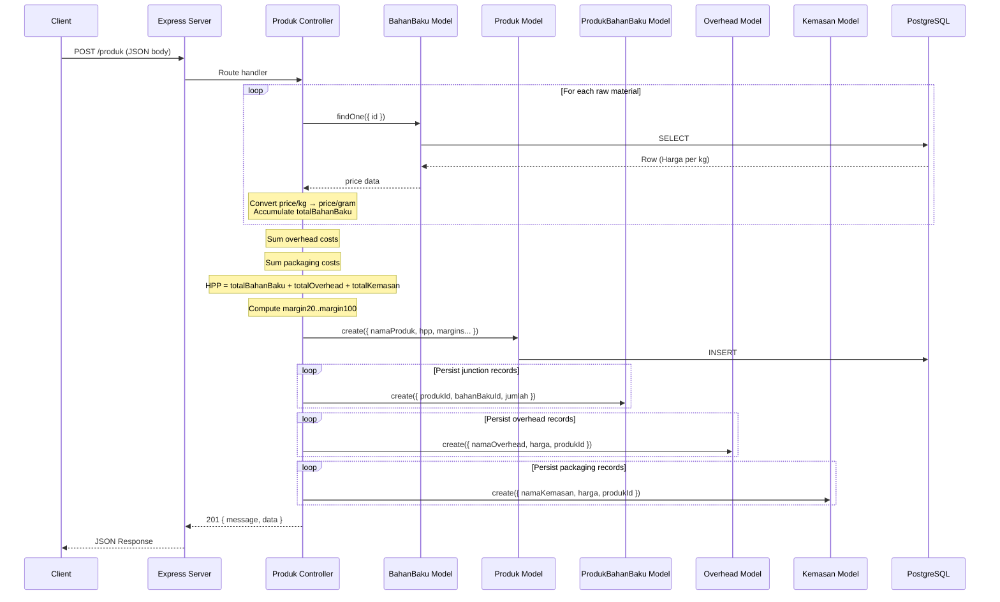
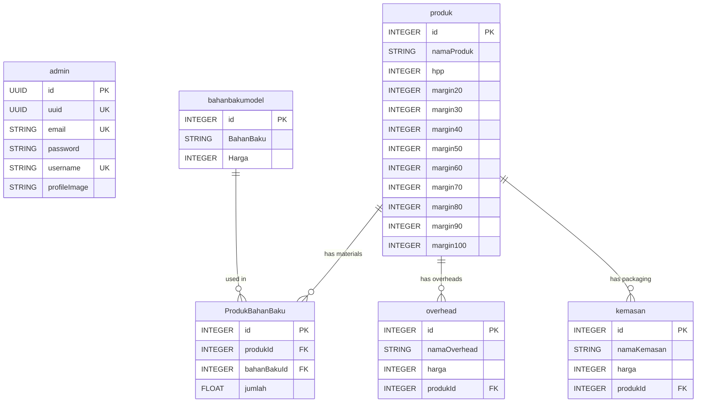

# 🏭 SPU Backend — Production Cost Engine API

> **Server-side REST API that powers the Production Information System for PT. Sukaraja Pangan Utama**, computing real-time *Harga Pokok Produksi* (HPP / Cost of Goods Manufactured) and multi-tier profit-margin projections from raw-material, overhead, and packaging cost inputs.


---

## Table of Contents

- [System Overview & Key Features](#system-overview--key-features)
- [System Architecture & Data Flow](#system-architecture--data-flow)
- [Tech Stack & Engineering Rationale](#tech-stack--engineering-rationale)
- [Security Posture & Scalability Considerations](#security-posture--scalability-considerations)
- [Key Engineering Highlights & Trade-offs](#key-engineering-highlights--trade-offs)
- [Database Schema & Migrations](#database-schema--migrations)
- [API Documentation & Quick Test](#api-documentation--quick-test)
- [Getting Started & Local Development](#getting-started--local-development)
- [Testing & Code Quality](#testing--code-quality)
- [Project Structure](#project-structure)

---

## System Overview & Key Features

The SPU Backend is a session-authenticated REST API built with **Express.js** on **Node.js (ES Modules)** and backed by **PostgreSQL** via the **Sequelize** ORM. It serves as the calculation and data-persistence layer for a manufacturing cost analysis system.

### Core Capabilities

| Capability | Detail |
|---|---|
| **HPP Computation Engine** | Aggregates raw-material costs (price-per-kilogram → price-per-gram conversion), overhead expenses, and packaging costs into a single *Harga Pokok Produksi* value per product. |
| **Multi-Tier Margin Projection** | Auto-generates selling prices at 9 configurable margin tiers (20%–100%) upon product creation or update — enabling instant what-if pricing analysis. |
| **Session-Based Authentication** | Server-side sessions persisted to PostgreSQL via `connect-session-sequelize`, with Argon2id password hashing (memory-hard, side-channel resistant). |
| **Session Guard Middleware** | Centralized `sessionChecker` middleware enforces authentication on protected routes, returning `401` with a structured JSON error on session expiry. |
| **Referential Integrity on Delete** | Raw-material records cannot be deleted while referenced by any product (`BahanBaku` ↔ `ProdukBahanBaku` foreign-key guard). |
| **Transactional Cascade Delete** | Product deletion wraps child-record cleanup (`ProdukBahanBaku`, `Overhead`, `Kemasan`) inside a Sequelize managed transaction to guarantee atomicity. |
| **Uniqueness Enforcement** | Email and username uniqueness validated at both the Sequelize model layer (field-level `unique` constraint) and the controller layer (explicit pre-check with descriptive error). |
| **Profile Image Upload** | Multer-based file upload pipeline with MIME-type + extension whitelist (`jpeg`, `jpg`, `png`), timestamped filenames to prevent collisions, and static file serving. |
| **Environment-Aware Config** | Tri-environment database configuration (`development`, `test`, `production`) driven by `NODE_ENV`, with isolated database names per environment. |
| **Dockerized Dev Environment** | One-command PostgreSQL provisioning via `docker-compose.yml`; `Makefile` wraps all common workflows (`make setup`, `make dev`, `make test`). |

---

## System Architecture & Data Flow

The application follows a **Layered MVC** architecture with a clear separation between routing, business logic (controllers), data access (Sequelize models), and cross-cutting concerns (middleware).



### Request Lifecycle (Product Creation)



---

## Tech Stack & Engineering Rationale

| Layer | Technology | Rationale |
|---|---|---|
| **Runtime** | Node.js (ES Modules) | Native `import/export` for clean module boundaries; non-blocking I/O suited for concurrent API requests. |
| **Framework** | Express 4.19 | Minimal-overhead HTTP layer with mature middleware ecosystem; explicit routing keeps the request pipeline auditable. |
| **ORM** | Sequelize 6.37 | Declarative model definitions with built-in validation, association management, and managed transactions — eliminating raw SQL while retaining escape-hatch access. |
| **Database** | PostgreSQL (via `pg` driver) | ACID-compliant relational store; strong support for UUID primary keys and concurrent writes critical for multi-user manufacturing systems. |
| **Auth / Hashing** | Argon2 (`argon2` npm) | Winner of the Password Hashing Competition; memory-hard algorithm resistant to GPU/ASIC brute-force attacks — superior to bcrypt for new deployments. |
| **Session Store** | `connect-session-sequelize` | Persists sessions to the same PostgreSQL instance, avoiding additional infrastructure (e.g., Redis) while enabling automatic expiration pruning (2-hour TTL). |
| **File Upload** | Multer 1.4.5-lts | Streaming multipart parser with per-field limits; combined with a MIME + extension whitelist to reject non-image payloads before they hit disk. |
| **Test Runner** | Mocha 10.7 | BDD-style test runner with first-class ES Module support via `--experimental-modules`; controller-level unit tests with manual mocks. |
| **Process Manager** | Nodemon 3.1 | File-watch auto-restart in development; zero-config for `.js` extensions. |
| **Env Management** | dotenv 16.4 | Twelve-Factor App compliant; secrets never committed to version control. |
| **Containerization** | Docker Compose | Reproducible PostgreSQL provisioning for dev and test environments; eliminates "works on my machine" issues. |

---

## Security Posture & Scalability Considerations

### Security Layers Implemented

| Vector | Mitigation | Implementation |
|---|---|---|
| **Password Brute-Force** | Argon2id hashing (memory-hard, timing-safe) | `argon2.hash()` / `argon2.verify()` in `controllers/Auth.js` and `controllers/Users.js` |
| **SQL Injection** | Parameterized queries via Sequelize ORM | All database interactions use Sequelize methods (`findOne`, `create`, `destroy`) — no raw SQL or string concatenation. |
| **Cross-Origin Abuse** | CORS restricted to explicit origin | `cors({ credentials: true, origin: "http://localhost:3000" })` in `index.js` — only the known frontend origin is allowed. |
| **Session Hijacking** | Server-side session store with auto-expiry | Sessions stored in PostgreSQL with a 2-hour TTL (`expiration: 120 * 60 * 1000`); `checkExpirationInterval` prunes stale sessions. Cookie `secure: "auto"` upgrades to HTTPS in production. |
| **Unrestricted File Upload** | MIME + extension whitelist | `uploadMiddleware.js` validates both `file.mimetype` and file extension against `/jpeg\|jpg\|png/` — rejects all non-image payloads. |
| **Credential Leakage** | `.env` exclusion from VCS | `.gitignore` includes `.env`; secrets loaded via `dotenv` at runtime only. |
| **Data Enumeration** | Selective attribute projection | User queries return only `["id", "uuid", "email", "username"]` — `password` is never included in API responses. |

### Known Gaps & Hardening Roadmap

| Gap | Risk Level | Recommended Mitigation |
|---|---|---|
| No rate limiting on `/login` | Medium | Add `express-rate-limit` to throttle authentication attempts (e.g., 5 req/min per IP). |
| No CSRF token validation | Low–Medium | The API is consumed by a React SPA over CORS with `credentials: true`. Express defaults to `SameSite=Lax` cookies, which blocks cross-site POST from third-party origins in modern browsers. For defense-in-depth, consider adding `csurf` or a custom double-submit cookie pattern. |
| No HTTP security headers | Low | Add `helmet` middleware to set `X-Content-Type-Options`, `Strict-Transport-Security`, `X-Frame-Options`, etc. |
| `db.sync({ alter: true })` in production | Medium | Auto-altering tables in production risks unintended schema changes. Migrate to `sequelize-cli` versioned migrations for production deployments. |

### Scalability Notes

| Concern | Current State | Path to Scale |
|---|---|---|
| **Stateful sessions** | Sessions persisted to PostgreSQL — the app tier itself is stateless (no in-memory session data). Multiple app instances behind a load balancer will share the same session store. | ✅ Horizontally scalable today. For high-throughput session lookups, swap `connect-session-sequelize` for Redis (`connect-redis`). |
| **Database connections** | Sequelize uses a default connection pool (min: 0, max: 5). | Tune `pool.max` via Sequelize config for higher concurrency. Consider PgBouncer for connection multiplexing at scale. |
| **File storage** | Profile images stored on local disk (`uploads/profile-images/`). | Migrate to object storage (S3 / GCS) for multi-instance deployments where local disk isn't shared. |
| **HPP computation** | Synchronous per-request calculation with sequential DB queries per raw material. | Acceptable for current product catalog size. For 10K+ products, batch raw-material lookups with a single `findAll({ where: { id: ids } })` query to eliminate N+1. |

---

## Key Engineering Highlights & Trade-offs

### 1. Transactional Cascade Delete for Data Consistency

Product deletion involves removing records across four tables (`ProdukBahanBaku`, `Overhead`, `Kemasan`, `Produk`). Rather than relying on database-level `ON DELETE CASCADE` (which can be opaque and hard to audit), the controller explicitly wraps all destroys inside a **Sequelize managed transaction**:

```javascript
// controllers/Produk.js — deleteProduk
await ProdukModel.sequelize.transaction(async (t) => {
  await ProdukBahanBakuModel.destroy({ where: { produkId: id }, transaction: t });
  await OverheadModel.destroy({ where: { produkId: id }, transaction: t });
  await KemasanModel.destroy({ where: { produkId: id }, transaction: t });
  await produk.destroy({ transaction: t });
});
```

**Trade-off:** This approach adds controller complexity but provides full visibility into the deletion order and automatic rollback on any failure — critical in a manufacturing system where orphaned cost records would corrupt HPP calculations.

### 2. Referential Guard on Raw-Material Deletion

Before deleting a `BahanBaku` (raw material) record, the controller explicitly checks for existing references in `ProdukBahanBaku`. This **fail-closed** guard prevents accidental data loss:

```javascript
// controllers/BahanBaku.js — deleteBahanBaku
const produkBahanBaku = await ProdukBahanBakuModel.findOne({
  where: { bahanBakuId: id },
});
if (produkBahanBaku) {
  return res.status(400).json({
    message: "Bahan Baku cannot be deleted — currently referenced by a product",
  });
}
```

**Trade-off:** The application-level guard adds a query per delete, but guarantees a user-friendly error message instead of a raw database constraint violation.

### 3. Unit-Price Normalization (kg → gram) with Integer Rounding

Raw-material prices are stored per kilogram but product recipes specify quantities in grams. The HPP engine normalizes on-the-fly:

```javascript
const hargaPerGram = bahan.Harga / 1000;
totalBahanBaku += hargaPerGram * item.jumlah;
```

All intermediate and final HPP values are `Math.round()`'ed to eliminate floating-point drift in currency calculations — a pragmatic choice over arbitrary-precision libraries given the integer-IDR context where sub-Rupiah precision is irrelevant.

---

## Database Schema & Migrations

### Entity Relationship



### Schema Synchronization

This project uses **Sequelize auto-sync** (`db.sync({ alter: true })`) rather than explicit migration files. On application startup, the ORM introspects the database and applies `ALTER TABLE` statements to align schemas with model definitions.

```bash
# Sync is triggered automatically on server start
make dev
```

> **⚠️ Production Note:** Replace `alter: true` with versioned migration files (`sequelize-cli db:migrate`) for deterministic, auditable, and reversible schema changes in production environments.

---

## API Documentation & Quick Test

### Authentication

#### Login

```bash
curl -X POST http://localhost:5000/login \
  -H "Content-Type: application/json" \
  -d '{
    "email": "admin@spu.co.id",
    "password": "securepassword"
  }'
```

**Response** `200 OK`:
```json
{
  "msg": "Login success",
  "uuid": "a1b2c3d4-e5f6-7890-abcd-ef1234567890",
  "email": "admin@spu.co.id",
  "username": "admin"
}
```

### Product (HPP Calculation)

#### Create Product with Full Cost Breakdown

```bash
curl -X POST http://localhost:5000/produk \
  -H "Content-Type: application/json" \
  -H "Cookie: connect.sid=<session_id>" \
  -d '{
    "namaProduk": "Keripik Singkong Premium",
    "bahanBaku": [
      { "id": 1, "jumlah": 500 },
      { "id": 2, "jumlah": 200 }
    ],
    "overhead": [
      { "namaOverhead": "Gas LPG", "harga": 15000 },
      { "namaOverhead": "Tenaga Kerja", "harga": 25000 }
    ],
    "kemasan": [
      { "namaKemasan": "Standing Pouch 250g", "harga": 3000 },
      { "namaKemasan": "Label Sticker", "harga": 1500 }
    ]
  }'
```

**Response** `201 Created`:
```json
{
  "message": "Produk Berhasil Ditambahkan",
  "data": {
    "id": 1,
    "namaProduk": "Keripik Singkong Premium",
    "hpp": 47000,
    "margin20": 56400,
    "margin30": 61100,
    "margin40": 65800,
    "margin50": 70500,
    "margin60": 75200,
    "margin70": 79900,
    "margin80": 84600,
    "margin90": 89300,
    "margin100": 94000
  }
}
```

#### Get Product Details with Nested Relations

```bash
curl -X GET http://localhost:5000/produkdetails/1 \
  -H "Cookie: connect.sid=<session_id>"
```

**Response** `200 OK`:
```json
{
  "message": "Data Produk Bahan Baku berhasil diambil",
  "data": [
    {
      "jumlah": 500,
      "bahanBaku": {
        "id": 1,
        "BahanBaku": "Singkong",
        "Harga": 8000
      },
      "produk": {
        "id": 1,
        "namaProduk": "Keripik Singkong Premium",
        "hpp": 47000,
        "margin20": 56400,
        "kemasans": [
          { "id": 1, "namaKemasan": "Standing Pouch 250g", "harga": 3000 }
        ],
        "overheads": [
          { "id": 1, "namaOverhead": "Gas LPG", "harga": 15000 }
        ]
      }
    }
  ]
}
```

### Complete API Reference

| Method | Endpoint | Description | Auth |
|---|---|---|---|
| `POST` | `/login` | Authenticate admin, create session | No |
| `GET` | `/me` | Get current authenticated user | Yes |
| `DELETE` | `/logout` | Destroy session, clear cookie | Yes |
| `GET` | `/users` | List all admin users | No |
| `GET` | `/users/:id` | Get admin by ID | No |
| `POST` | `/users` | Register new admin | No |
| `PATCH` | `/users/:id` | Update admin profile / password | No |
| `DELETE` | `/users/:id` | Delete admin | No |
| `GET` | `/bahanbaku` | List all raw materials | No |
| `POST` | `/bahanbaku` | Add raw material | No |
| `PATCH` | `/bahanbaku/:id` | Update raw material | No |
| `DELETE` | `/bahanbaku/:id` | Delete raw material (guarded) | No |
| `POST` | `/produk` | Create product with HPP calc | No |
| `GET` | `/produkdetails` | List all products with relations | No |
| `GET` | `/produkdetails/:produkId` | Get product detail by ID | No |
| `PATCH` | `/produkbahanbaku/:id` | Update product and recalculate HPP | No |
| `DELETE` | `/produkdelete/:id` | Delete product (transactional) | No |
| `POST` | `/upload-profile` | Upload admin profile image | Yes* |
| `GET` | `/profile-image` | Get current user's profile image | Yes* |

> \* Session-based auth enforced at the controller level via `req.session.userId` check.

---

## Getting Started & Local Development

### Prerequisites

| Tool | Version | Purpose |
|---|---|---|
| **Node.js** | ≥ 18.x | ES Module support, runtime |
| **npm** | ≥ 9.x | Dependency management |
| **Docker & Docker Compose** | Latest | PostgreSQL provisioning (or install PostgreSQL natively) |
| **Make** | Any | Workflow automation (pre-installed on macOS/Linux) |

### Quick Start (3 Commands)

```bash
make setup      # Install deps + create .env from template
make db-up      # Start PostgreSQL via Docker Compose
make dev        # Start Express server on :5000 with auto-reload
```

### Step-by-Step Setup

#### 1. Clone the Repository

```bash
git clone <repository-url>
cd Untitled
```

#### 2. Install Dependencies & Configure Environment

```bash
make setup
```

This runs `npm install` and copies `.env.example` → `.env` if the file doesn't exist yet. Then edit `.env` with your credentials:

```env
# General
APP_PORT=5000
SESS_SECRET=your-strong-random-secret-here

# Development Database
PGUSER_DEV=postgres
PGPASSWORD_DEV=postgres
PGDATABASE_DEV=spuofficial
PGHOST_DEV=localhost
PGPORT_DEV=5432
PGDIALECT_DEV=postgres
```

#### 3. Start PostgreSQL

**Option A — Docker Compose (recommended):**
```bash
make db-up
```

This starts a `postgres:16-alpine` container with automatic health checking. The database `spuofficial` is created automatically.

**Option B — Native PostgreSQL:**
```bash
createdb spuofficial
createdb spuofficial_test    # optional, for tests
```

#### 4. Start the Development Server

```bash
make dev
```

The server starts on `http://localhost:5000` with auto-reload via Nodemon. Sequelize auto-syncs all table schemas on startup.

#### 5. Verify the Server

```bash
curl -s http://localhost:5000/bahanbaku
# Expected: {"message":"Daftar Bahan Baku","data":[]}
```

### Available Make Targets

Run `make help` to see all available commands:

| Target | Command | Description |
|---|---|---|
| `setup` | `make setup` | Install dependencies + create `.env` |
| `db-up` | `make db-up` | Start dev PostgreSQL via Docker |
| `db-down` | `make db-down` | Stop database containers |
| `db-test-up` | `make db-test-up` | Start test PostgreSQL (port 5433) |
| `dev` | `make dev` | Start dev server (Nodemon) |
| `prod` | `make prod` | Start production server |
| `test` | `make test` | Run Mocha test suite |
| `lint` | `make lint` | Run ESLint |
| `clean` | `make clean` | Remove node_modules + Docker volumes |

### Available npm Scripts

| Script | Command | Description |
|---|---|---|
| **Development** | `npm run start:dev` | Start with Nodemon + `NODE_ENV=development` |
| **Production** | `npm run start:prod` | Start with `NODE_ENV=production` |
| **Test** | `npm run start:test` | Run Mocha test suite with `NODE_ENV=test` |

---

## Testing & Code Quality

### Test Architecture

Tests reside in `__test__/` and are written as **controller-level unit tests** using **Mocha** with Node's built-in `assert` module. Each test file manually mocks Sequelize model methods (`findOne`, `findByPk`, `create`, `destroy`) and Argon2 functions to isolate controller logic from the database.

### Test Coverage Summary

| Test File | Controller | Test Cases | Assertions |
|---|---|---|---|
| `AdminController.test.mjs` | Auth (Login/Logout) | Password verification, session creation, session destruction, cookie clearing | 6 |
| `BahanBakuController.test.mjs` | BahanBaku (CRUD) | Add, update, delete (with referential guard), list all | 8 |
| `ProdukController.test.mjs` | Produk (HPP Engine) | Create with cost calc, update with recalc, list all, detail by ID, transactional delete | 10 |
| `uploadController.test.mjs` | Upload (Profile Image) | Upload success, auth guard (401), admin not found (404), image not found (404) | 8 |

**Total: 4 test suites · 15 test cases · 32 assertions**

### Running Tests

```bash
# Run the full test suite via Makefile
make test

# Or directly via npm
npm run start:test

# Run a specific test file
npx mocha --experimental-modules --es-module-specifier-resolution=node __test__/ProdukController.test.mjs
```

### Code Quality Targets

| Metric | Current | Target |
|---|---|---|
| **Unit test coverage** | All controllers covered (Auth, BahanBaku, Produk, Upload) | ≥ 80% line coverage |
| **Integration tests** | Not yet implemented | Add Supertest-based API integration tests |
| **Linting** | Not yet configured | Add ESLint + Prettier |
| **Pre-commit hooks** | Not yet configured | Add Husky + lint-staged |

### Recommended Quality Tooling Additions

```bash
# Install linting and formatting
npm install --save-dev eslint prettier eslint-config-airbnb-base eslint-plugin-import

# Install test coverage reporting
npm install --save-dev c8

# Run tests with coverage
npx c8 mocha --experimental-modules --es-module-specifier-resolution=node **/*.test.mjs

# Install pre-commit hooks
npm install --save-dev husky lint-staged
npx husky init
```

---

## Project Structure

```
.
├── .github/
│   ├── ISSUE_TEMPLATE/
│   │   ├── bug_report.md              # Structured bug report template
│   │   └── feature_request.md         # Feature request template
│   └── PULL_REQUEST_TEMPLATE.md       # PR checklist template
├── __test__/                          # Unit tests (Mocha + assert)
│   ├── AdminController.test.mjs       # Auth controller tests
│   ├── BahanBakuController.test.mjs   # Raw material controller tests
│   ├── ProdukController.test.mjs      # Product/HPP controller tests
│   └── uploadController.test.mjs      # File upload controller tests
├── config/
│   └── Database.js                    # Sequelize instance + env-aware config
├── controllers/
│   ├── Auth.js                        # Login / Logout / Me (session mgmt)
│   ├── BahanBaku.js                   # Raw material CRUD + referential guard
│   ├── Produk.js                      # HPP computation + transactional delete
│   ├── Users.js                       # Admin user management (Argon2 hashing)
│   └── uploadController.js            # Profile image upload/retrieve
├── middleware/
│   ├── sessionChecker.js              # Session validation guard
│   └── uploadMiddleware.js            # Multer config (storage + file filter)
├── models/
│   ├── AdminModel.js                  # Admin entity (UUID PK, Argon2 password)
│   ├── BahanBakuModel.js              # Raw material entity
│   ├── KemasanModel.js                # Packaging entity (belongsTo Produk)
│   ├── OverheadModel.js               # Overhead cost entity (belongsTo Produk)
│   ├── ProdukBahanBakuModel.js        # Many-to-many junction table
│   └── ProdukModel.js                 # Product entity with margin fields
├── routes/
│   ├── AdminRoute.js                  # /users endpoints
│   ├── AuthRoute.js                   # /login, /logout, /me endpoints
│   ├── BahanBakuRoute.js              # /bahanbaku endpoints
│   ├── ProdukRoute.js                 # /produk, /produkdetails endpoints
│   └── uploadRoute.js                 # /upload-profile, /profile-image
├── uploads/
│   └── profile-images/                # Uploaded admin profile images
├── .env.example                       # Environment variable template
├── .gitignore                         # node_modules, .env, .DS_Store
├── docker-compose.yml                 # PostgreSQL dev/test containers
├── LICENSE                            # ISC License
├── Makefile                           # Workflow automation targets
├── SECURITY.md                        # Vulnerability disclosure policy
├── index.js                           # Application entry point
├── package.json                       # Dependencies + scripts
└── README.md                          # ← You are here
```

---

## License

This project is licensed under the **ISC License**. See `package.json` for details.

---

<p align="center">
  <sub>Built for <strong>PT. Sukaraja Pangan Utama</strong> · Production Information System</sub>
</p>
