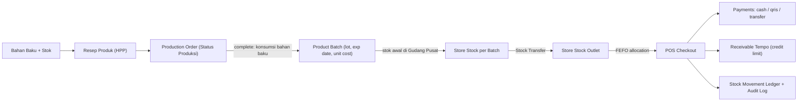
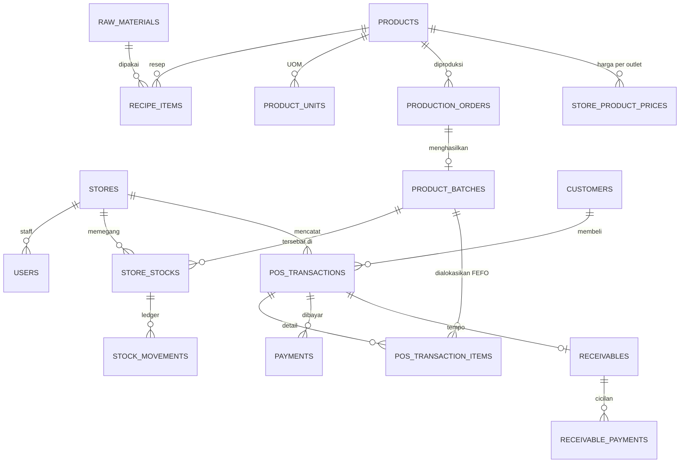
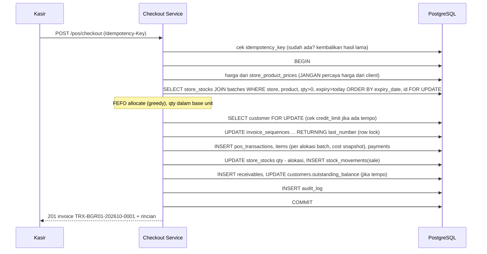

# Plan: Modernisasi Backend SPU + Sistem POS Kasir Terintegrasi

> Branch: `CJS-Backend-Local(-Tugas-Akhir)` · Stack sekarang: Express 4 + Sequelize 6 + PostgreSQL (dev) · JavaScript CommonJS

## 1. Tujuan

1. **Menstabilkan & mengamankan** codebase yang ada (bug logika, celah keamanan, redundansi).
2. **Memodernisasi arsitektur** secara bertahap ke TypeScript dengan modular monolith + layered architecture, migrasi DB, test otomatis, dan CI.
3. **Membangun POS Kasir yang terintegrasi dengan produksi SPU**: produk bumbu hasil produksi menjadi **batch barang jadi** (dengan tanggal kedaluwarsa), didistribusikan ke **outlet**, lalu dijual lewat **checkout ACID** dengan **FEFO**, **multi-UOM**, **split payment**, dan **piutang tempo** (padanan *yarnen*).

Setiap sprint harus bisa **didemokan lewat Postman**, punya test, dan berkaitan dengan satu pilar materi backend (Hussein Nasser).

---

## 2. Hasil Audit Codebase (Baseline)

### 🔴 Kritis (Keamanan)

| # | Temuan | Lokasi | Dampak |
|---|---|---|---|
| S1 | Kredensial DB production ter-*hardcode* sebagai fallback dan **sudah masuk git history** (commit `b125db3`, remote GitHub) | [Database.js#L24-L29](file:///Users/hasanabdurrahman/MyProject/SPU/spu/config/Database.js#L24-L29) | Siapa pun yang punya akses repo bisa masuk DB production |
| S2 | Hampir semua route **tanpa autentikasi**; `sessionChecker` hanya dipakai di `/me` | `routes/*.js` | Siapa pun bisa CRUD produk, stok, user |
| S3 | `POST /users` terbuka dan menerima `role` bebas, sehingga siapa pun bisa membuat akun superadmin | [Users.js#L38-L71](file:///Users/hasanabdurrahman/MyProject/SPU/spu/controllers/Users.js#L38-L71) | Privilege escalation |
| S4 | Password plaintext ditulis ke log (`console.log("Password:", ...)`) | [Users.js#L119-L121](file:///Users/hasanabdurrahman/MyProject/SPU/spu/controllers/Users.js#L119-L121) | Kebocoran kredensial di log |
| S5 | Tidak ada `session.regenerate()` saat login (session fixation), tidak ada rate limit login, tidak ada `helmet` | [Auth.js](file:///Users/hasanabdurrahman/MyProject/SPU/spu/controllers/Auth.js) | Serangan brute-force & fixation |
| S6 | Upload: multer berjalan sebelum cek auth, tanpa batas ukuran, `req.file` tidak divalidasi, file lama tidak dihapus | [uploadRoute.js](file:///Users/hasanabdurrahman/MyProject/SPU/spu/routes/uploadRoute.js), [uploadMiddleware.js](file:///Users/hasanabdurrahman/MyProject/SPU/spu/middleware/uploadMiddleware.js) | Disk exhaustion, crash |

### 🟠 Bug Logika

| # | Temuan | Lokasi |
|---|---|---|
| B1 | **HPP salah hitung saat update.** Postgres mengembalikan `DECIMAL` sebagai *string*, sehingga `produk.hpp += totalOverhead` menjadi **penggabungan string** (`"1000.000" + 500 = "1000.000500"`). Selain itu, jika hanya overhead yang dikirim, overhead baru ditambahkan ke HPP lama yang sudah mengandung overhead lama (terhitung ganda). Jika hanya bahan baku yang dikirim, overhead & kemasan hilang dari HPP. | [Produk.js#L213-L250](file:///Users/hasanabdurrahman/MyProject/SPU/spu/controllers/Produk.js#L213-L250) |
| B2 | `addProduk` / `updateProduk` **tanpa transaksi**; `updateProduk` menghapus resep lama dulu baru validasi bahan, jadi jika error di tengah, data korup | [Produk.js#L23-L148](file:///Users/hasanabdurrahman/MyProject/SPU/spu/controllers/Produk.js#L23-L148) |
| B3 | **Connection leak:** `addBahanBaku` membuka transaksi lalu `return` tanpa `rollback()` saat validasi gagal, sehingga koneksi pool tertahan selamanya (pool max 10, jadi 10 request invalid bisa membuat server hang) | [BahanBaku.js#L23-L42](file:///Users/hasanabdurrahman/MyProject/SPU/spu/controllers/BahanBaku.js#L23-L42) |
| B4 | **Race condition stok:** stok dibaca lalu ditulis tanpa row lock (`SELECT ... FOR UPDATE`), sehingga dua produksi bersamaan bisa menghasilkan *lost update* | [StatusProduk.js#L125-L148](file:///Users/hasanabdurrahman/MyProject/SPU/spu/controllers/StatusProduk.js#L125-L148) |
| B5 | `deleteStatusProduksi` tidak mengembalikan stok bahan baku; `updateStatusProduksi` mengizinkan ganti `KodeProduksi` tapi selisih stok dihitung dengan resep produk **baru** | [StatusProduk.js](file:///Users/hasanabdurrahman/MyProject/SPU/spu/controllers/StatusProduk.js) |
| B6 | Race condition `KodeProduksi`: `getNextBatchNumber` membaca nomor terakhir tanpa lock/unique constraint, sehingga dua request bersamaan bisa mendapat kode sama | [getNextBatchNumber.js](file:///Users/hasanabdurrahman/MyProject/SPU/spu/utils/getNextBatchNumber.js) |
| B7 | `findOrCreate` di `updateBahanBaku` mengisi kolom `Satuan`/`Harga` yang tidak ada di `StokBahanBaku` (diabaikan diam-diam) | [BahanBaku.js#L132-L160](file:///Users/hasanabdurrahman/MyProject/SPU/spu/controllers/BahanBaku.js#L132-L160) |
| B8 | Kode status HTTP keliru (duplikat → 404, seharusnya 409; error server → 400) | beberapa controller |

### 🟡 Redundansi & Desain

- `getUserInfo()` diduplikasi di 5 controller, padahal seharusnya cukup satu middleware yang memuat `req.user`.
- `switch` margin 9 cabang diduplikasi 2×; 9 kolom `margin20..margin100` hanya hasil turunan dari `hpp`.
- Relasi dicocokkan lewat **string nama** (`PenjualanProduk.NamaProduk` ↔ `Produk.namaProduk`, `StatusProduksi.KodeProduksi`), bukan foreign key.
- Angka disimpan sebagai `STRING` (`JumlahProduksi`, `Terjual`, `Margin`).
- `StokBahanBaku.BahanBaku` menduplikasi nama bahan (denormalisasi tanpa alasan).
- Backend memformat harga menjadi string locale (`"15.000"`); formatting seharusnya dilakukan di frontend.
- `console.log` debug char-code di `getAllProdukBahanBaku`.
- `sync({ alter: true })` saat startup (berbahaya di production), dan `mysql2` + config `development2` adalah sisa lama.

### ⚫ Infrastruktur

- **Test suite rusak total:** Mocha 10 crash di Node 26 (`require is not defined in ES module scope`); test `.mjs` mengimpor named export dari modul CJS; test hanya me-mock model.
- Belum ada CI, linter, migrasi, atau seeder. Docker belum terpasang di mesin ini.
- ✅ Tersedia: Node 26, Bun 1.3.12, PostgreSQL 15 (Homebrew), Redis (aktif).
- ✅ Working tree Anda sudah berisi perbaikan `index.js` yang bagus (graceful startup, 404 & error handler, health check, CORS dinamis). Ini akan dipertahankan sebagai titik awal.

---

## 3. User Review Required

> [!CAUTION]
> **Rotasi password DB production harus Anda lakukan sendiri** di cPanel/hosting **sekarang juga**, terlepas dari plan ini. Menghapus dari kode tidak menghapusnya dari git history di GitHub. Membersihkan history (`git filter-repo`) bersifat opsional dan memerlukan force-push; saya **tidak** akan melakukannya tanpa izin eksplisit.

> [!WARNING]
> **Breaking changes API.** Refactor akan mengubah bentuk URL & response (misalnya `/produkdelete/:id` → `DELETE /api/v1/products/:id`, envelope response standar). Jika ada frontend aktif (React di `:3000` / `produksi.pabrikbumbu.com`), route lama bisa dipertahankan sementara sebagai **alias deprecated** sampai frontend dimigrasi.

> [!WARNING]
> **DB development akan di-reset** (sudah Anda setujui). Skema lama digantikan migrasi bersih; data dev dibuat ulang lewat seeder.

> [!IMPORTANT]
> **Definisi HPP.** Dari logika `PenjualanProduk` (`HargaSatuan = margin / JumlahProduksi`), saya simpulkan `hpp` adalah **biaya satu resep / satu kali produksi**, bukan per pcs. Plan ini memakai definisi: `unit_cost = total_biaya_produksi / jumlah_hasil (yield)`. Mohon konfirmasi.

---

## 4. Open Questions

> [!IMPORTANT]
> 1. **Mode eksekusi:** apakah (a) **saya yang mengimplementasikan** per sprint lalu Anda review & coba di Postman, atau (b) **saya memandu step-by-step dan Anda mengetik sendiri** seperti sebelumnya (lebih lambat, tapi lebih baik untuk *muscle memory*), atau (c) hybrid: fondasi/boilerplate saya kerjakan, logika bisnis inti (FEFO, checkout, HPP) Anda tulis dengan panduan?
> 2. **DB production:** config production saat ini memakai **MySQL** (cPanel), sedangkan dev memakai Postgres. Plan ini menstandarkan ke **PostgreSQL saja** (row lock, partial index, `EXPLAIN ANALYZE`). Apakah production boleh dipindah ke Postgres, atau harus tetap kompatibel MySQL?
> 3. **Frontend:** apakah frontend React lama masih dipakai/di-deploy? Ini menentukan perlu tidaknya alias route lama.
> 4. **Docker:** belum terpasang. Install Docker Desktop/OrbStack (agar `docker compose` & image bisa dites lokal), atau cukup Postgres Homebrew lokal + Postgres service container di GitHub Actions?

---

## 5. Arsitektur Target

### 5.1 Peta Domain (Value Chain Terintegrasi)



### 5.2 Struktur Folder (Modular Monolith, Layered)

```text
src/
├── app.ts                    # express app (tanpa listen) → mudah dites dengan supertest
├── server.ts                 # bootstrap: db.authenticate, listen, graceful shutdown (SIGTERM)
├── config/
│   ├── env.ts                # validasi env dengan zod (fail fast jika kosong)
│   └── database.ts           # Sequelize instance + pool
├── shared/
│   ├── http/                 # AppError, asyncHandler, response envelope
│   ├── middleware/           # requireAuth, requireRole, validate(zod), errorHandler, requestLogger
│   ├── audit/                # audit.service.ts (pengganti 5x getUserInfo + RiwayatLog)
│   └── db/                   # withTransaction helper, migrations/, seeders/
└── modules/
    ├── auth/                 # login, logout, me
    ├── users/
    ├── production/           # raw-materials, recipes(products), production-orders  (dari JS lama)
    ├── inventory/            # product-batches, store-stocks, stock-movements, transfers
    ├── stores/
    ├── customers/
    ├── pos/                  # checkout, transactions, void, offline-sync
    └── receivables/          # piutang tempo, pembayaran, aging
        └── <module>/
            ├── *.routes.ts
            ├── *.controller.ts   # HTTP saja: parse req → panggil service → kirim res
            ├── *.service.ts      # business logic + transaksi
            ├── *.repository.ts   # akses DB (query, lock)
            ├── *.schema.ts       # zod validation (request DTO)
            └── *.test.ts
```

**Strategi migrasi bertahap ke TS:** `tsconfig` dengan `allowJs: true`, dev runner `tsx watch`. File JS lama tetap jalan; modul baru (POS) langsung ditulis dalam TS, dan modul lama dipindah satu per satu ke TS saat di-refactor (Sprint 2).

### 5.3 Model Data Target



| Tabel | Kolom penting | Catatan desain |
|---|---|---|
| `stores` | `code` (UNIQUE), `name`, `type` (`warehouse`/`outlet`), `city` | Gudang pusat = store bertipe `warehouse` |
| `users` | `store_id` (NULL = HQ), `role` ENUM(`superadmin`,`production_staff`,`store_manager`,`cashier`) | Menggantikan tabel `Admin` |
| `products` | `sku` (UNIQUE), `name`, `base_unit`, `shelf_life_days`, `min_stock_alert` | `shelf_life_days` → hitung `expiry_date` batch |
| `product_units` | `product_id`, `unit_name` (pcs/pack/karton), `conversion_to_base` | Multi-UOM: 1 karton = 40 pcs |
| `production_orders` | `product_id` FK, `batch_code` UNIQUE, `planned_qty`, `yield_qty` NUMERIC, `status` ENUM, `total_cost` | Pengganti `StatusProduksiModel` (FK, bukan string) |
| `product_batches` | `product_id`, `production_order_id`, `batch_code`, `production_date`, `expiry_date`, `unit_cost` | Dibuat saat produksi **complete** |
| `store_stocks` | `store_id`, `batch_id`, `quantity` (base unit), `version` | UNIQUE(`store_id`,`batch_id`), CHECK `quantity >= 0` |
| `stock_movements` | `store_id`, `batch_id`, `type` (`production_in`,`transfer_out`,`transfer_in`,`sale`,`void`,`adjustment`), `qty_delta`, `ref_type`, `ref_id` | **Append-only ledger**: stok bisa direkonstruksi & diaudit |
| `store_product_prices` | `store_id`, `product_id`, `unit_id`, `price` | Harga per outlet (ongkos logistik) |
| `customers` | `code`, `name`, `phone`, `type` (`retail`,`warung`,`agen`), `credit_limit`, `outstanding_balance` | Padanan `farmers` + plafon kasbon |
| `pos_transactions` | `invoice_no` UNIQUE, `store_id`, `cashier_id`, `customer_id`, `subtotal`, `discount`, `total`, `status` (`paid`,`partial`,`unpaid_tempo`,`void`), `idempotency_key` UNIQUE, `client_uuid` | |
| `pos_transaction_items` | `transaction_id`, `product_id`, `batch_id`, `unit_id`, `qty`, `qty_base`, `unit_price`, `unit_cost_snapshot`, `subtotal` | 1 baris per **alokasi batch** (FEFO bisa memecah 1 item ke 2 batch) |
| `payments` | `transaction_id`, `method` (`cash`,`qris`,`bank_transfer`,`tempo`), `amount` | Split payment |
| `receivables` / `receivable_payments` | `customer_id`, `transaction_id`, `due_date`, `total`, `remaining`, `status` | Piutang tempo |
| `invoice_sequences` | `store_id`, `period` (YYYYMM), `last_number` | Penomoran invoice bebas race (row lock) |

**Uang:** disimpan sebagai `BIGINT` rupiah utuh untuk transaksi POS (rupiah tidak punya sen), dan `NUMERIC(14,4)` untuk biaya per gram/HPP. Seluruh nilai `NUMERIC` di-*parse* eksplisit di repository agar bug B1 tidak terulang.

---

## 6. Rencana Sprint

Setiap sprint = 1 PR kecil + test hijau + folder Postman + catatan belajar.

| Sprint | Tema | Deliverable yang bisa didemokan | Pilar Hussein Nasser |
|---|---|---|---|
| **0** | Safety net & security hotfix | Kredensial bersih, route terproteksi, test infra jalan, CI hijau | Keamanan, Timeouts |
| **1** | Fondasi TypeScript & arsitektur | `src/` layered, migrasi umzug, RBAC, error envelope | Web Server, Sync vs Async |
| **2** | Refactor modul Produksi | Bug B1–B8 fixed, ledger stok bahan baku, production order → batch | ACID, Isolation & Locking |
| **3** | Master data POS | Stores, customers, product units, harga per outlet, stock transfer | Primary vs Secondary Key, Indexing |
| **4** | **POS Checkout** | `POST /pos/checkout` FEFO + split payment + idempotency | ACID, Row Lock, Deadlock |
| **5** | Piutang Tempo | Bayar cicilan, credit limit, aging report | Transaksi & konsistensi |
| **6** | Offline sync & performa | Batch sync, Redis cache & session, index + `EXPLAIN ANALYZE`, p95 latency | Caching, Pub-Sub, Tail Latency |
| **7** | QA & DevOps polish | Coverage ≥ 80%, Dockerfile, OpenAPI/Postman, ADR & README | CI/CD |

---

### Sprint 0 — Safety Net & Security Hotfix

**Tujuan:** tidak ada perubahan perilaku bisnis; fokus mengamankan & membuat test bisa jalan.

#### [MODIFY] config/Database.js
- Hapus semua fallback kredensial (`|| "Z5O4aG..."`, `|| "panganutama_admin"`, host production) dan config `development2`.
- Tambah `test` environment (sebelumnya hilang di branch ini).

#### [NEW] src/config/env.ts *(boleh JS dulu di sprint ini)*
```ts
const EnvSchema = z.object({
  NODE_ENV: z.enum(["development", "test", "production"]).default("development"),
  APP_PORT: z.coerce.number().default(5000),
  SESS_SECRET: z.string().min(32),
  DB_HOST: z.string(), DB_PORT: z.coerce.number().default(5432),
  DB_NAME: z.string(), DB_USER: z.string(), DB_PASSWORD: z.string().default(""),
  REDIS_URL: z.string().optional(),
});
export const env = EnvSchema.parse(process.env); // crash saat boot jika env salah = fail fast
```
- Hapus fallback `"spu_default_session_secret"` di `index.js`.
- Variabel `PGUSER_DEV/_TEST/...` disederhanakan menjadi satu set `DB_*` per file `.env` / `.env.test`.

#### [MODIFY] routes/*.js — proteksi semua route
```js
router.use(requireAuth);                                  // semua route di bawah butuh login
router.post("/users", requireRole("superadmin"), createUser);
```
- `POST /login` & `GET /health` tetap publik. User pertama dibuat lewat **seeder**, bukan endpoint terbuka.

#### [MODIFY] controllers/Auth.js
- `req.session.regenerate()` sebelum set `userId` (anti session fixation).
- Pesan login disatukan menjadi `401 "Email atau password salah"` (anti user enumeration).
- Hapus semua `console.log` password/body.

#### [NEW] Hardening middleware
- `helmet`, `express-rate-limit` di `/login` (misal 5 percobaan/menit/IP), `express.json({ limit: "100kb" })`.
- Perbaikan upload (dari diskusi sebelumnya): `requireAuth` sebelum multer, `limits.fileSize = 2MB`, validasi `req.file`, hapus file lama.

#### Test infra
- Hapus Mocha; pasang **Vitest** + **Supertest** (Vitest mendukung TS/ESM/CJS tanpa konfigurasi rumit dan cepat).
- Database test terpisah `spudev_test`; setiap test file berjalan dalam transaksi yang di-rollback / truncate di `beforeEach`.
- **Characterization tests** (golden master) untuk endpoint yang ada sekarang, untuk mengunci perilaku sebelum refactor. Test yang mendokumentasikan bug (B1, B3) ditandai `it.fails(...)` lalu dibalik di Sprint 2.

#### [NEW] .github/workflows/ci.yml
```yaml
services:
  postgres: { image: postgres:16-alpine, env: {...}, ports: ["5432:5432"], options: --health-cmd pg_isready }
steps: [checkout, setup-node@v4 (node 22), npm ci, npm run lint, npm run typecheck, npm run test:coverage]
```

**Postman:** folder `00-Auth` (login → cookie tersimpan otomatis → `/me` → coba akses tanpa login = 401).

---

### Sprint 1 — Fondasi TypeScript & Arsitektur

- `typescript`, `tsx`, `@types/*`, `eslint` (flat config) + `prettier`; `tsconfig` `strict: true`, `allowJs: true`.
- Pisahkan `app.ts` (definisi app) dari `server.ts` (listen + graceful shutdown `SIGTERM` → tutup server → `db.close()`).
- **Migrasi DB:** `umzug` + `SequelizeStorage`, folder `src/shared/db/migrations`. Hapus `db.sync({ alter: true })` dari startup. Script: `db:migrate`, `db:rollback`, `db:seed`, `db:reset`.
- **Shared layer:**
  ```ts
  // AppError → errorHandler memetakan ke envelope standar
  { "success": false, "error": { "code": "INSUFFICIENT_STOCK", "message": "...", "details": {...} } }
  { "success": true, "data": {...}, "meta": { "page": 1, "total": 120 } }
  ```
  - `asyncHandler` (Express 4 tidak menangkap rejected promise secara otomatis).
  - `requireAuth` memuat `req.user` **sekali** → menghapus 5 duplikat `getUserInfo()`.
  - `requireRole(...roles)`, `validate(zodSchema)`.
  - `audit.service.record(tx, { actor, action, entity, entityId, before, after })` menggantikan `RiwayatLog.create` yang tersebar.
  - `withTransaction(fn)` helper, menjamin `rollback` di semua jalur (mencegah ulang bug B3).
- Logging terstruktur `pino` + `pino-http` (request id, response time).
- Versioning: semua route baru di bawah `/api/v1`.

**Postman:** `GET /health`, contoh error envelope (validasi gagal 422, 401, 403, 404).

---

### Sprint 2 — Refactor Modul Produksi (Bug Fix)

Porting `BahanBaku`, `StokBahanBaku`, `Produk`, `StatusProduk` ke `src/modules/production` (TS).

1. **HPP sebagai pure function** (mudah di-unit-test, memperbaiki B1):
   ```ts
   export function calculateRecipeCost(items: {qty: number; unitPrice: number}[], overheads: number[], packaging: number[]) {
     const material = items.reduce((s, i) => s + i.qty * i.unitPrice, 0);
     return { material, overhead: sum(overheads), packaging: sum(packaging), total: material + sum(overheads) + sum(packaging) };
   }
   ```
   Update produk **selalu menghitung ulang dari seluruh komponen** (bukan `+=` ke nilai lama).
2. **Margin:** hapus 9 kolom `margin20..100`; hitung saat dibaca: `marginTiers(hpp) → [{ pct: 20, price }, ...]`. Harga jual sebenarnya diatur di `store_product_prices` (Sprint 3).
3. Semua write dalam **satu transaksi**; ganti loop `create` dengan `bulkCreate`; ganti N+1 `findOne` dengan satu `findAll({ where: { id: ids } })` (O(n) query → O(1) query).
4. **Production order** menggantikan `StatusProduksi`: FK `product_id`, qty `NUMERIC`, status ENUM `planned → in_progress → completed | cancelled`.
   - `POST /production-orders/:id/complete` (dalam 1 transaksi):
     `SELECT ... FOR UPDATE` stok bahan baku (diurutkan berdasarkan id agar **tidak deadlock**) → validasi cukup → kurangi → catat `raw_material_movements` → buat `product_batch` (`expiry_date = production_date + shelf_life_days`, `unit_cost = total_cost / yield_qty`) → tambah `store_stocks` gudang pusat → `stock_movements(production_in)` → audit.
   - `cancel` mengembalikan stok (memperbaiki B5). Cron hanya untuk menandai status, bukan untuk memutasi stok.
5. `batch_code` digenerate dari tabel sequence dengan row lock + UNIQUE constraint (memperbaiki B6).
6. Hapus `StokBahanBaku.BahanBaku` (nama duplikat); stok bahan baku juga memakai pola ledger.
7. `PenjualanProduk` lama di-*deprecate*: read-only, lalu digantikan POS (Sprint 4).

**Postman:** `02-Production`: buat bahan baku → isi stok → buat produk/resep (lihat HPP) → buat production order → complete → lihat batch barang jadi lahir di gudang pusat.

---

### Sprint 3 — Master Data POS

- CRUD `stores`, `customers`, `product_units`, `store_product_prices`; `users.store_id` (kasir hanya bisa bertransaksi di outlet-nya: **scoping** di middleware/service).
- `POST /inventory/transfers`: gudang pusat → outlet, memindahkan batch FEFO dari gudang (`transfer_out` + `transfer_in` dalam satu transaksi).
- `GET /inventory/stocks?store_id=&product_id=` agregasi per produk + rincian per batch + flag `near_expiry` (≤ 30 hari) & `below_min_stock`.
- Index pertama + catatan `EXPLAIN ANALYZE` sebelum/sesudah (lihat Sprint 6).

**Postman:** `03-MasterData`: buat outlet "SPU-BGR-01", customer warung dengan `credit_limit`, set harga per outlet, transfer 2 batch ke outlet.

---

### Sprint 4 — POS Checkout (Inti)

#### Endpoint
```http
POST /api/v1/pos/checkout
Idempotency-Key: 7b1f...-uuid        # kasir double-click / retry jaringan → tidak dobel transaksi
{
  "customer_id": 12,
  "items": [{ "product_id": 3, "unit_id": 2, "qty": 2 }],     # 2 pack
  "discount": 0,
  "payments": [{ "method": "cash", "amount": 20000 }, { "method": "tempo", "amount": 30000 }],
  "tempo_due_date": "2026-11-07"
}
```

#### Alur dalam SATU transaksi


#### FEFO allocation (pure function, mudah dites)
```ts
// batches sudah terurut expiry_date ASC dari query (index-backed) → O(b) greedy
export function allocateFefo(batches: { batchId: number; available: number }[], needed: number) {
  const allocations = [];
  for (const b of batches) {
    if (needed <= 0) break;
    const take = Math.min(b.available, needed);
    if (take > 0) { allocations.push({ batchId: b.batchId, qty: take }); needed -= take; }
  }
  if (needed > 0) throw new AppError(409, "INSUFFICIENT_STOCK", { shortBy: needed });
  return allocations;
}
```
**Kompleksitas:** O(b) waktu dan O(b) ruang per item, dengan b = jumlah batch aktif. Pengurutan diserahkan ke index B+Tree `(store_id, product_id, expiry_date)`, jadi tidak ada sort di memori.

#### Aturan bisnis yang dites
- Batch kedaluwarsa tidak pernah terjual; satu item boleh terpecah ke 2+ batch.
- `sum(payments) == total`; metode `tempo` wajib `customer_id` & `outstanding + tempo ≤ credit_limit`.
- Retry dengan `Idempotency-Key` sama mengembalikan **response yang sama**, tanpa transaksi baru.
- **Uji konkurensi:** 20 checkout paralel atas stok 10 menghasilkan tepat 10 unit terjual, stok tidak pernah negatif (dibuktikan dengan `Promise.all` di test + `CHECK (quantity >= 0)`).
- `POST /pos/transactions/:id/void` (store_manager): reverse ledger (`void`), kembalikan stok ke batch asal, batalkan piutang.
- `GET /pos/transactions/:id`, `GET /pos/transactions?store_id&date_from&date_to` (pagination).

**Postman:** `04-POS`: checkout cash → checkout split cash+tempo → checkout melebihi stok (409) → checkout melebihi credit limit (422) → kirim ulang dengan Idempotency-Key sama → void.

---

### Sprint 5 — Piutang Tempo (Receivables)

- `GET /receivables?customer_id&status&overdue=true`
- `POST /receivables/:id/payments` → lock receivable `FOR UPDATE`, `remaining -= amount` (tidak boleh minus), update `customers.outstanding_balance`, status `paid` saat lunas.
- `GET /reports/receivables/aging` → bucket `current`, `1–30`, `31–60`, `>60` hari (satu query `CASE WHEN` + `GROUP BY`).
- Pelanggan dengan piutang overdue diblokir dari transaksi tempo baru (aturan bisnis yang dapat dikonfigurasi).

**Postman:** `05-Receivables`: cicil 2× sampai lunas, cek aging report.

---

### Sprint 6 — Offline Sync & Performa

1. **Offline sync:** `POST /api/v1/pos/sync` menerima array transaksi offline (`client_uuid` unik per transaksi = idempotency natural).
   - Diproses berurutan sesuai `client_created_at`; masing-masing satu transaksi DB.
   - Hasil per item: `synced | duplicate | conflict` (misal stok tidak cukup → transaksi tetap dicatat dengan flag `needs_review`, karena barang fisik **sudah** berpindah tangan). Ini adalah keputusan desain yang akan didokumentasikan dalam ADR.
2. **Redis:**
   - Session store dipindah ke `connect-redis`, mengurangi query DB di setiap request.
   - Cache katalog harga per outlet (`cache-aside`, TTL + invalidasi saat harga diubah).
   - Rate limiter berbasis Redis (konsisten jika server lebih dari satu instance).
3. **Indexing & query plan** (dengan seeder data besar, misal 200k transaksi):
   ```sql
   CREATE INDEX idx_stock_fefo ON store_stocks (store_id, product_id, expiry_date) WHERE quantity > 0;  -- partial index
   CREATE INDEX idx_trx_store_date ON pos_transactions (store_id, created_at DESC);
   CREATE INDEX idx_recv_customer_open ON receivables (customer_id) WHERE status <> 'paid';
   ```
   Hasil `EXPLAIN (ANALYZE, BUFFERS)` sebelum/sesudah (Seq Scan → Index Scan) didokumentasikan di `docs/performance.md`.
4. **Metrik:** histogram latency per route (p50/p95/p99) dari `pino-http`; script load test `autocannon` untuk checkout, hasilnya dicatat.
5. **Laporan:** `GET /reports/sales/daily?store_id` (omzet, HPP terjual, gross margin dari `unit_cost_snapshot`), produk terlaris, stok mendekati kedaluwarsa.

---

### Sprint 7 — QA & DevOps Polish

- Coverage ≥ 80% (gate di CI), test unit (pure functions) + integrasi (Supertest + Postgres nyata).
- `Dockerfile` multi-stage (build TS → runtime `node:22-alpine`, user non-root) + `docker-compose.yml` (api + postgres + redis).
- Dokumentasi: koleksi Postman + environment di `docs/postman/` (di-generate dari OpenAPI `zod-to-openapi`, atau dikelola manual), `docs/adr/` (ADR: session vs JWT, FEFO, ledger, offline conflict policy), README diperbarui.
- Opsional: Newman (Postman CLI) dijalankan di CI sebagai smoke test.

---

## 7. Peta Belajar per Sprint (untuk Interview & Portofolio)

| Konsep | Di mana Anda melihatnya di kode | Pertanyaan interview yang bisa dijawab |
|---|---|---|
| Connection leak | Bug B3 → `withTransaction` | "Apa yang terjadi jika transaksi tidak di-rollback?" |
| ACID & isolation | Checkout, production complete | "Kenapa `READ COMMITTED` + `SELECT FOR UPDATE` cukup di sini?" |
| Deadlock avoidance | Lock diurutkan berdasarkan id | "Bagaimana mencegah deadlock saat lock banyak baris?" |
| Idempotency | `Idempotency-Key`, `client_uuid` | "Bagaimana menangani retry pembayaran?" |
| B+Tree & partial index | `idx_stock_fefo` | "Kenapa composite index urutannya begitu?" |
| Event ledger | `stock_movements` | "Bagaimana mengaudit selisih stok?" |
| Caching | Redis cache-aside | "Kapan cache di-invalidate?" |
| Tail latency | p95/p99 checkout | "Kenapa rata-rata latency menyesatkan?" |
| Algoritma | FEFO greedy O(b), aging buckets | Big-O & alasan pemilihan struktur data |

---

## 8. Verification Plan

### Automated Tests
```bash
npm run lint && npm run typecheck
npm run db:reset:test            # migrate + seed DB test
npm run test                     # vitest: unit + integrasi (supertest)
npm run test:coverage            # gate ≥ 80% (Sprint 7)
```
- CI GitHub Actions menjalankan semua di atas pada setiap push/PR dengan Postgres service container.
- Test khusus: konkurensi checkout (stok tidak pernah negatif), idempotency, FEFO melewati batch kedaluwarsa, HPP update (regresi B1), tidak ada koneksi bocor (cek `pool.size` setelah 20 request invalid, regresi B3).

### Manual Verification (Postman)
- Satu folder Postman per sprint (`00-Auth` … `06-Reports`) dengan environment `{{url}}`, cookie session otomatis, dan **test script** Postman (`pm.expect(...)`) di setiap request.
- Skenario end-to-end akhir: **login superadmin → buat bahan baku & stok → buat produk → produksi → complete (lahir batch) → transfer ke outlet → login kasir outlet → checkout split cash + tempo → bayar cicilan piutang → lihat laporan harian & aging**.
- `psql` untuk memverifikasi ledger: `SUM(qty_delta)` di `stock_movements` = `store_stocks.quantity` untuk setiap batch.
