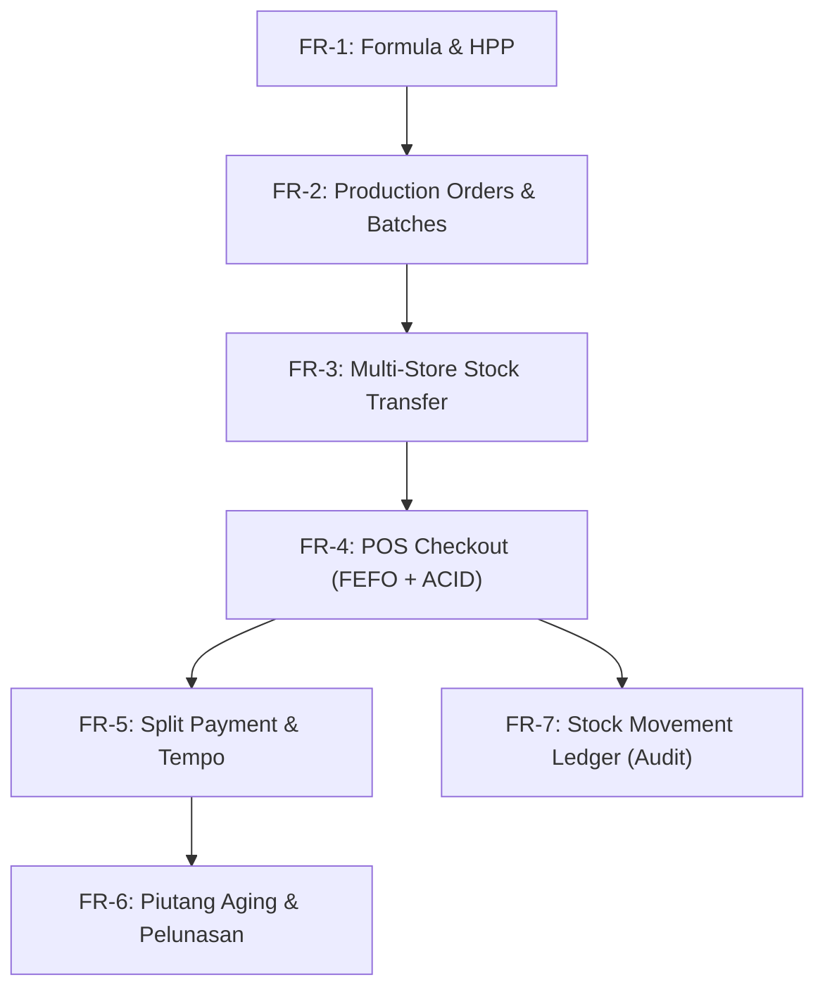
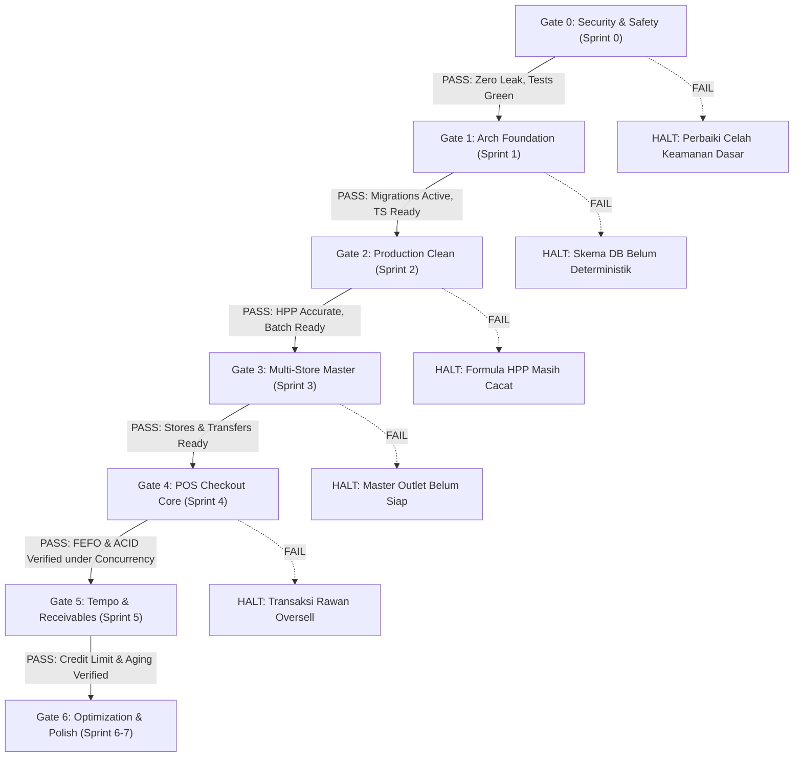

# Engineering Master Plan: SPU Backend Modernization & Integrated POS Kasir Agro-Retail

> **Target:** PT. Sukaraja Pangan Utama (SPU) End-to-End Value Chain (Pabrik Produksi Bumbu → Multi-Outlet Kasir Agro-Retail)  
> **Standard:** Japanese High-Reliability Tech Ecosystem (Mercari / PayPay / LINE standards) & Modern Backend Engineering (Hussein Nasser curriculum)  
> **Branch Active:** `CJS-Backend-Local(-Tugas-Akhir)`

---

## 1. Goal Description & Executive Summary

Proyek ini mentransformasi backend monolitik Node.js/Express lawas dari sistem kalkulasi HPP dan produksi pabrik bumbu menjadi **Production-Ready End-to-End Enterprise System**:
1. **Memperbaiki fondasi keamanan & bug logika fatal** yang ada di codebase warisan (kredensial bocor, kebocoran koneksi pool, race condition stok, salah hitung HPP).
2. **Memodernisasi arsitektur secara bertahap ke TypeScript** dengan pola *Modular Monolith* berlapis (*Routes → Controller → Service → Repository*), migrasi database deterministik (*Umzug*), dan automated testing (*Vitest + Supertest*).
3. **Membangun Domain POS Kasir Agro-Retail Terintegrasi**: Batch barang jadi hasil produksi dialokasikan secara **FEFO** (*First Expired, First Out*), didistribusikan ke **Multi-Store**, dan ditransaksikan dengan **ACID Row-Level Locking**, **Idempotency Key**, serta **Piutang Tempo (*Yarnen*)** berbasis limit kredit.

---

## 2. Product Requirement Document (PRD)

### 2.1 Problem Statement
1. **Sisi Operasional Pabrik (Existing SPU):** Kalkulasi HPP rawan salah karena penanganan tipe desimal yang tidak konsisten; produksi dapat menguras stok melebihi ketersediaan fisik jika terjadi request paralel; tidak ada pelacakan batch barang jadi yang siap jual.
2. **Sisi Ritel & Distribusi (Agro-Retail Dynamics):** Barang pangan olahan & agro-input memiliki masa kedaluwarsa ketat. Sistem kasir standar mengabaikan nomor lot/batch, tidak mendukung penjualan multi-satuan (sak vs kg vs sachet), rawan *double billing* saat koneksi kasir putus-nyambung, dan gagal mengelola piutang petani/warung mitra yang membayar tempo (*yarnen*).

### 2.2 User Personas & Use Cases

| Persona | Tanggung Jawab Utama | Kebutuhan Kritis di Sistem |
|---|---|---|
| **Staff Produksi (Factory Staff)** | Meracik formula, menginput produksi bumbu | Input otomatis potong bahan baku, generate batch dengan tanggal kedaluwarsa & HPP riil |
| **Store Manager (Kepala Cabang)** | Mengelola inventaris outlet, otorisasi khusus | Menerima transfer stok dari pabrik, approve void transaksi, pantau stok kedaluwarsa |
| **Kasir Toko (Cashier)** | Melayani transaksi cepat di kasir | Checkout cepat (<200ms), FEFO otomatis tanpa pilih batch manual, split payment, offline resilience |
| **Mitra / Petani (Customer)** | Membeli retail atau partai besar dengan tempo | Pencatatan kasbon/tempo, plafon kredit (*credit limit*), rekap kartu piutang |
| **Superadmin / Owner** | Pengawasan menyeluruh & kepatuhan keuangan | Laporan laba kotor harian, audit log mutasi stok (*ledger*), penagihan piutang jatuh tempo |

### 2.3 Functional Requirements (FR)



- **FR-1 (Resep & Biaya):** Formulasi bumbu (bahan baku, overhead, kemasan) menghitung HPP per batch dan yield satuan secara atomik.
- **FR-2 (Batch Barang Jadi):** Penyelesaian produksi melahirkan `product_batches` berstatus aktif dengan nomor lot unik, `expiry_date = prod_date + shelf_life`, dan `unit_cost_snapshot`.
- **FR-3 (Multi-Store Inventory):** Stok terisolasi per cabang (`store_stocks`). Mutasi antar cabang dilakukan via surat jalan transfer stok.
- **FR-4 (Kasir FEFO Otomatis):** Kasir hanya memasukkan SKU produk dan kuantitas. Sistem secara otomatis mengalokasikan batch terdekat kedaluwarsa (*greedy FEFO*).
- **FR-5 (Metode Pembayaran Fleksibel):** Mendukung kombinasi Cash, QRIS, Transfer Bank, dan Tempo.
- **FR-6 (Piutang Tempo / Yarnen):** Transaksi tempo memvalidasi sisa plafon kredit (`outstanding + tempo <= credit_limit`). Cicilan piutang mencatat mutasi pelunasan.
- **FR-7 (Append-Only Stock Ledger):** Tidak ada pengurangan stok tanpa baris jurnal di `stock_movements`.
- **FR-8 (Idempotent POS):** Request checkout dengan `Idempotency-Key` sama mengembalikan response identik tanpa menduplikasi potongan stok.

### 2.4 Non-Functional Requirements (NFR)

| Metrik | Target | Justifikasi Teknis |
|---|---|---|
| **P95 Latency (Checkout)** | `< 150 ms` | Menghindari antrean kasir menumpuk; query `SELECT FOR UPDATE` terindeks B-Tree |
| **P99 Latency (Catalog Read)** | `< 30 ms` | Didukung caching Redis *cache-aside* per cabang |
| **Data Consistency** | Strict Serializability / ACID | `READ COMMITTED` + explicit Row Lock pada baris batch stok & saldo pelanggan |
| **Availability Target** | 99.9% uptime | Graceful shutdown `SIGTERM`, pooling auto-reconnect |
| **Security Baseline** | OWASP Top 10 Compliant | Zero hardcoded secrets, argon2id hashing, parameterized queries, RBAC guard |

---

## 3. Decision Layer (JEV - Justified Expected Value Matrix)

Setiap keputusan arsitektur diuji melalui kerangka **Justified Expected Value**:  
$$\text{JEV} = \frac{\text{Business Value} \times \text{Confidence Level}}{\text{Implementation Cost (Hours)} \times \text{Architectural Risk}}$$

| Area Keputusan | Pilihan Alternatif | Keputusan Terpilih | Justifikasi Teknis (JEV Rationale) |
|---|---|---|---|
| **Arsitektur Sistem** | Microservices vs Modular Monolith | **Modular Monolith in TypeScript** | *Microservices* menambah overhead jaringan (RPC/gRPC), distributed transactions (2PC/Saga), dan CI/CD kompleks yang membuang waktu. Modular Monolith memberikan *clean boundary* in-memory dengan latensi O(1) dan transaksi DB ACID native. |
| **Bahasa & Runtime** | Full Go Rewrite vs Pure JS vs Hybrid TS | **Hybrid Progressive TypeScript (Node.js)** | Codebase JS eksisting (CJS) tetap bisa jalan berdampingan (`allowJs: true`). Modul baru ditulis TS dengan tipe statis ketat. Tidak membuang 90% memori kode lama Anda, namun memberi tipe aman bagi modul finansial/kasir. |
| **Database Engine** | MySQL vs MongoDB vs PostgreSQL | **PostgreSQL 15+ Native** | POS butuh *row-level locking* (`SELECT ... FOR UPDATE`), *partial index* (`WHERE quantity > 0`), dan tipe `NUMERIC` eksak. Mongo tidak cocok untuk transaksi multi-tabel reliabel; MySQL di cPanel rentan perbedaan konfigurasi engine (InnoDB vs MyISAM). |
| **Schema Evolution** | `sequelize.sync({alter:true})` vs Umzug Migrations | **Umzug Migration Scripts** | `sync({alter:true})` di produksi sering mengunci tabel (*table lock*), memotong data diam-diam, atau gagal saat tipe data tidak kompatibel (UUID → INT). Migrasi berbasis file menjamin auditability di Git dan zero data loss. |
| **Session vs JWT** | Pure JWT vs Hybrid Stateful Session | **Stateful Session (Redis / PostgreSQL Store)** | Kasir membutuhkan kemampuan instan untuk *revocation* (jika kasir di-logout paksa oleh manajer). JWT stateless tidak bisa dicabut sebelum expired tanpa memelihara blacklist (yang ujungnya butuh state juga). Cookie `HttpOnly` + `SameSite` kebal dari pencurian script XSS. |
| **Penomoran Invoice** | `COUNT(*)` vs UUID vs Sequence Table with Row Lock | **Sequence Table with Row Lock** | Format faktur kasir wajib sekuensial dan ramah manusia (`TRX-BGR01-202610-0001`). UUID membingungkan di struk kasir. `COUNT(*)` menyebabkan duplikat saat konkurensi tinggi. Tabel sequence khusus terisolasi menjamin angka unik tanpa gap fatal. |

---

## 4. Engineering Guardrails

### 4.1 Technical Guardrails (Reliability & Performance)
1. **Zero Connection Leak Rule:** Semua transaksi database wajib dibungkus dalam `withTransaction(async (t) => { ... })` yang otomatis melakukan rollback jika terjadi unhandled exception atau validation error sebelum proses selesai. Dilarang menggunakan `sequelize.transaction()` manual tanpa blok `try/catch/finally` yang terverifikasi.
2. **Deadlock Prevention Order:** Ketika sebuah transaksi membutuhkan lock pada banyak baris (misalnya mengunci beberapa bahan baku atau beberapa batch stok), baris **wajib dikunci dengan urutan ID terkecil ke terbesar (`ORDER BY id ASC FOR UPDATE`)**. Mengunci secara acak memicu deadlock fatal.
3. **No Float for Money/Units:** Dilarang menggunakan tipe `FLOAT` atau `DOUBLE` untuk nilai uang atau kuantitas stok. Wajib menggunakan `BIGINT` untuk mata uang Rupiah dan `NUMERIC(14, 4)` untuk kuantitas konversi multi-UOM (misal gram ke kg).
4. **Boundary Isolation:** Controller Express hanya bertugas: *Parse input DTO → Validasi Zod → Panggil Service → Format Response Envelope*. Dilarang keras menulis query Sequelize (`Model.findOne`, `Model.create`) langsung di controller.

### 4.2 Security Guardrails
1. **Zero Unauthenticated Endpoints by Default:** Semua route berada di bawah `requireAuth` kecuali `POST /api/v1/auth/login` dan `GET /health`.
2. **Role-Based Access Control (RBAC):** Endpoint administratif (tambah user, ubah formula, void transaksi) wajib melewati middleware `requireRole('superadmin', 'store_manager')`.
3. **Log Sanitization:** Seluruh payload request yang melewati middleware audit/logger wajib di-filter dari field sensitif: `password`, `confPassword`, `token`, `secret`.
4. **Payload & Rate Limiting:** Body parser dibatasi maksimal `100kb` untuk JSON. Endpoint `/api/v1/auth/login` dibatasi maksimal 5 percobaan per menit per alamat IP.

---

## 5. Vulnerability, Bug, & Technical Debt Matrix

```mermaid
quadrantChart
    title Risk vs Impact Matrix
    x-axis Low Technical Impact --> High Technical Impact
    y-axis Low Probability --> High Probability
    quadrant-1 Immediate Blocker (P0)
    quadrant-2 High Risk Vulnerability (P1)
    quadrant-3 Low Priority Debt (P3)
    quadrant-4 Architectural Flaw (P2)
    "S1: Hardcoded Prod Secret": [0.95, 0.95]
    "B1: String HPP Calc": [0.90, 0.90]
    "B3: Connection Pool Leak": [0.85, 0.85]
    "B4: Stock Race Condition": [0.80, 0.75]
    "S2: Open Unprotected Routes": [0.75, 0.90]
    "S6: Unsafe File Upload": [0.70, 0.80]
    "B6: Duplicate Batch Code": [0.65, 0.60]
    "D1: Broken Test Suite": [0.60, 0.95]
    "D2: sync(alter:true) Hazard": [0.55, 0.70]
```

### 5.1 Rincian Kerentanan & Cacat Teknis

| ID | Kategori | Deskripsi Cacat | Dampak Teknis / Bisnis | Rencana Remediasi |
|---|---|---|---|---|
| **S1** | **Security (Critical)** | Kredensial DB cPanel production tertulis di [Database.js#L24-L30](file:///Users/hasanabdurrahman/MyProject/SPU/spu/config/Database.js#L24-L30) dan telah ter-push ke GitHub remote. | Siapapun dengan akses repo publik/tim dapat mengambil alih DB server pabrik. | Hapus seluruh fallback hardcoded, gunakan `env.ts` strict validation, rekomendasikan rotasi password di server host. |
| **S2** | **Security (High)** | Seluruh route di `routes/*.js` terbuka tanpa auth (hanya `/me` yang dilindungi). | Siapapun dapat menghapus stok atau data produk lewat cURL/Postman. | Pasang global middleware `requireAuth` pada grup route `/api/v1`. |
| **S3** | **Security (High)** | `POST /users` tidak membatasi role; user luar bisa register langsung dengan role `superadmin`. | Eskalasi hak akses tidak terbatas (*Privilege Escalation*). | Kunci endpoint `/users` dengan `requireRole('superadmin')`; buat superadmin pertama lewat seeder CLI. |
| **S4** | **Security (Medium)** | Plaintext password dicetak ke terminal lewat `console.log("Password:", password)`. | Kebocoran kredensial di log monitoring server / CI log. | Hapus seluruh debug logging plaintext; terapkan pino logger terfilter. |
| **S6** | **Security (High)** | Multer berjalan sebelum cek session; tanpa batas ukuran; file lama tidak terhapus. | *Disk exhaustion attack* (DoS) dan akumulasi file sampah abadi di disk. | Pindahkan `requireAuth` sebelum multer; pasang limit 2MB; hapus file lama via `fs.unlinkSync`. |
| **B1** | **Logic Bug (Critical)** | Postgres mengembalikan `DECIMAL` sebagai string. Kode melakukan `produk.hpp += totalOverhead` sehingga terjadi string concat `"1000.000" + 500 = "1000.000500"`. Saat update, HPP terhitung ganda. | Kalkulasi HPP dan proyeksi margin laba salah total secara finansial. | Buat pure function `calculateRecipeCost` dengan parsing `Number`/`BigInt` eksplisit; hitung ulang dari komponen awal setiap update. |
| **B3** | **Reliability (Critical)** | `addBahanBaku` membuka transaksi `sequelize.transaction()` lalu melakukan `return res.status(400)` tanpa `rollback()` saat validasi gagal. | Koneksi DB di pool tertahan selamanya (*Connection Leak*). Setelah 10 request salah, server hang total. | Bungkus dengan `withTransaction` wrapper yang otomatis rollback pada segala bentuk exit/error. |
| **B4** | **Concurrency (High)** | Produksi memotong stok bahan baku dengan pola `read -> calculate in JS -> write` tanpa database lock. | Dua proses produksi bersamaan memicu *lost update* dan stok minus. | Tambahkan klausa `lock: transaction.LOCK.UPDATE` (`SELECT ... FOR UPDATE`) pada query stok. |
| **B6** | **Integrity (Medium)** | `getNextBatchNumber` membaca kode terakhir via `Op.like` tanpa row lock atau unique index. | Dua batch bersamaan menghasilkan nomor lot identik, merusak integritas pelacakan barang. | Gunakan tabel sekuensial atau atomic increment dengan constraint `UNIQUE(product_id, batch_code)`. |
| **D1** | **Technical Debt (High)** | Test Mocha crash di Node 26 (`require is not defined in ES module scope`); unit test hanya memalsukan model tanpa menguji DB nyata. | Zero test confidence; refactor rawan memunculkan regresi tanpa terdeteksi. | Migrasi test runner ke **Vitest**; sediakan database test lokal terisolasi (`spudev_test`). |
| **D2** | **Technical Debt (High)** | `db.sync({ alter: true })` dijalankan setiap server boot. | Bahaya race condition skema saat cluster mode; alter gagal pada migrasi tipe tertentu. | Ganti dengan migrasi file deterministik via **Umzug**. |

---

## 6. Software Development Life Cycle (SDLC) & Agile Execution

### 6.1 Branching & Git Strategy
- **Base Branch:** `CJS-Backend-Local(-Tugas-Akhir)`
- **Feature Branches:** `feat/sprint-0-security-safety`, `feat/sprint-1-ts-foundation`, `feat/sprint-2-production-refactor`, `feat/sprint-3-pos-master`, `feat/sprint-4-pos-checkout`, `feat/sprint-5-receivables`, `feat/sprint-6-perf-sync`, `feat/sprint-7-devops-polish`.
- **Commit Convention:** Conventional Commits (`feat:`, `fix:`, `refactor:`, `test:`, `docs:`, `perf:`).

### 6.2 Definition of Done (DoD) per Sprint
Setiap Sprint dianggap selesai (**DONE**) HANYA JIKA:
1. Seluruh kode lolos typecheck (`npm run typecheck`) dan linter tanpa warning fatal.
2. Seluruh unit test dan integration test terkait sprint tersebut berstatus **PASSED**.
3. Koleksi Postman untuk modul tersebut telah diuji dan menghasilkan status code serta payload yang valid.
4. Tidak ada hardcoded credentials atau connection leak yang tertinggal.
5. Memenuhi checkpoint **Go / No-Go Decision Gate**.

---

## 7. ROI-Based Go / No-Go Decision Framework

Setiap fase memiliki gerbang evaluasi (**Gate Checkpoint**) berbasis ROI (Return on Investment: Kualitas Sistem, Kesiapan Wawancara, Mitigasi Risiko Bisnis vs Waktu Pengerjaan):



### Rincian Gerbang Keputusan (Go / No-Go Gates)

#### Gate 0: Safety Net & Security Hardening (Post-Sprint 0)
- **Kriteria Evaluasi (GO):**
  - Kredensial DB production 100% dibersihkan dari kode aktif.
  - Endpoint dilindungi middleware `requireAuth`.
  - Test runner Vitest berjalan sukses dan mendokumentasikan baseline sistem.
- **ROI Impact:** **Sangat Tinggi (Risiko Hukum & Reputasi Teratasi).** Mencegah kebocoran data riil pabrik dan memastikan refactor tidak merusak fungsi dasar.
- **Keputusan NO-GO jika:** Masih ada endpoint publik yang bisa memanipulasi user/produk, atau koneksi DB masih bocor saat error.

#### Gate 1: TypeScript & Schema Migration (Post-Sprint 1)
- **Kriteria Evaluasi (GO):**
  - Database terinisialisasi bersih lewat file migrasi `umzug up` (bukan `sync alter`).
  - Error envelope standar `{ success, data, error }` aktif di semua rute.
- **ROI Impact:** **Tinggi.** Memberi landasan tipe data statis dan mematikan potensi kerusakan skema saat aplikasi di-restart.
- **Keputusan NO-GO jika:** Migrasi DB gagal dijalankan dari scratch atau tipe data tidak sinkron.

#### Gate 2: Accurate HPP & Finished Good Batches (Post-Sprint 2)
- **Kriteria Evaluasi (GO):**
  - Kalkulasi HPP terbukti akurat dalam unit test (menghitung angka desimal murni, tanpa string concat).
  - Status produksi selesai otomatis melahirkan record `product_batches` dengan tanggal kedaluwarsa dan nomor lot.
- **ROI Impact:** **Sangat Tinggi (Integritas Nilai Bisnis).** Barang jadi kini memiliki identitas lot yang siap dialirkan ke kasir.
- **Keputusan NO-GO jika:** HPP masih terhitung ganda saat update atau stok bahan baku berkurang tanpa lock.

#### Gate 3 & 4: POS Checkout Core with FEFO & ACID (Post-Sprint 4)
- **Kriteria Evaluasi (GO):**
  - Uji konkurensi (20 request checkout paralel pada 10 stok) membuktikan tepat 10 yang sukses dan sisa stok adalah 0 (tidak minus).
  - Request dengan batch kedaluwarsa dilewati secara otomatis oleh algoritma alokasi FEFO.
  - Header `Idempotency-Key` menjamin tidak ada duplikasi transaksi saat jaringan terputus.
- **ROI Impact:** **Maksimal (Nilai Jual Utama saat Wawancara).** Menunjukkan penguasaan transaksi ACID, row locking, dan algoritma industri agro-retail.
- **Keputusan NO-GO jika:** Terjadi *overselling* (stok minus) atau race condition pada penomoran invoice.

#### Gate 5, 6, & 7: Receivables, Caching & DevOps Delivery (Post-Sprint 7)
- **Kriteria Evaluasi (GO):**
  - Laporan aging piutang tempo terbukti akurat.
  - P95 latency terukur di bawah 150ms dengan Redis caching aktif.
  - Test coverage mencapai $\ge 80\%$ dan Dockerfile siap di-build.
- **ROI Impact:** **Sangat Tinggi (Standar Kualifikasi Engineering Jepang).** Portofolio siap ditunjukkan ke recruiter / hiring manager dengan pembuktian analitis menyeluruh.

---

## 8. Proposed Changes & Implementation Strategy

Perubahan dikelompokkan ke dalam paket Sprint bertahap. 

### Sprint 0: Safety Net & Security Hotfix (Fokus Hari Ini)

#### [MODIFY] [config/Database.js](file:///Users/hasanabdurrahman/MyProject/SPU/spu/config/Database.js)
Hapus seluruh string fallback production, ganti dengan binding variabel lingkungan murni:
```javascript
// Bersihkan kredensial hardcoded; gunakan konfigurasi berbasis env murni
const config = {
  development: {
    username: process.env.DB_USER || "hasanabdurrahman",
    password: process.env.DB_PASSWORD || "",
    database: process.env.DB_NAME || "spudev",
    host: process.env.DB_HOST || "localhost",
    dialect: "postgres",
    port: parseInt(process.env.DB_PORT || "5432", 10),
  },
  test: {
    username: process.env.DB_USER_TEST || "hasanabdurrahman",
    password: process.env.DB_PASSWORD_TEST || "",
    database: process.env.DB_NAME_TEST || "spudev_test",
    host: process.env.DB_HOST_TEST || "localhost",
    dialect: "postgres",
    port: parseInt(process.env.DB_PORT_TEST || "5432", 10),
  }
};
```

#### [NEW] [middleware/requireAuth.js](file:///Users/hasanabdurrahman/MyProject/SPU/spu/middleware/requireAuth.js)
Middleware sentral yang memuat objek user ke `req.user` sekaligus menutup semua celah controller:
```javascript
const Admin = require("../models/AdminModel.js");

const requireAuth = async (req, res, next) => {
  if (!req.session || !req.session.userId) {
    return res.status(401).json({ success: false, message: "Akses ditolak: Silakan login terlebih dahulu." });
  }
  try {
    const user = await Admin.findByPk(req.session.userId, {
      attributes: ["id", "uuid", "username", "email", "role"]
    });
    if (!user) {
      req.session.destroy();
      return res.status(401).json({ success: false, message: "Sesi tidak valid: Pengguna tidak ditemukan." });
    }
    req.user = user;
    next();
  } catch (error) {
    res.status(500).json({ success: false, message: "Internal server error saat verifikasi sesi." });
  }
};

const requireRole = (...roles) => (req, res, next) => {
  if (!req.user || !roles.includes(req.user.role)) {
    return res.status(403).json({ success: false, message: "Akses ditolak: Hak akses tidak memadai." });
  }
  next();
};

module.exports = { requireAuth, requireRole };
```

#### [MODIFY] [routes/uploadRoute.js](file:///Users/hasanabdurrahman/MyProject/SPU/spu/routes/uploadRoute.js) & [middleware/uploadMiddleware.js](file:///Users/hasanabdurrahman/MyProject/SPU/spu/middleware/uploadMiddleware.js)
Pasang `requireAuth` sebelum multer dan tambahkan limit 2MB serta cleanup file otomatis.

#### [NEW] Test Runner Setup (Vitest + Supertest)
Hapus script mocha yang crash di Node 26, instal vitest dan buat initial characterization test untuk memverifikasi proteksi route dan flow login.

---

## 9. Verification Plan

### Automated Tests
1. **Linter & Typecheck:**
   ```bash
   npm run lint
   npm run typecheck
   ```
2. **Unit & Integration Suite (Vitest):**
   ```bash
   npm run test
   ```
   *Target Gate 0:* Tes verifikasi auth guard (mengembalikan 401 saat belum login), tes login gagal rate-limit, dan tes sanitasi upload.

### Manual Verification via Postman
1. **Verifikasi Auth Boundary:**
   - Kirim `GET http://localhost:5000/bahanbaku` tanpa cookie session $\rightarrow$ Ekspektasi: `401 Unauthorized`.
   - Kirim `POST http://localhost:5000/users` dengan body user baru tanpa login admin $\rightarrow$ Ekspektasi: `401 Unauthorized`.
2. **Verifikasi Login & Session Persisten:**
   - Kirim `POST http://localhost:5000/login` dengan kredensial valid $\rightarrow$ Ekspektasi: `200 OK`, cookie `connect.sid` tersimpan.
   - Panggil kembali `GET http://localhost:5000/bahanbaku` dengan cookie $\rightarrow$ Ekspektasi: `200 OK`.
3. **Verifikasi Sanitasi Log:**
   - Periksa console terminal server: tidak ada teks password atau payload sensitif yang tercetak secara terbuka.
